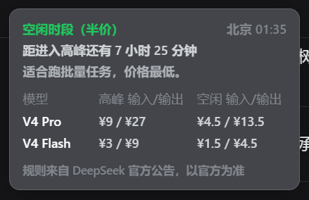
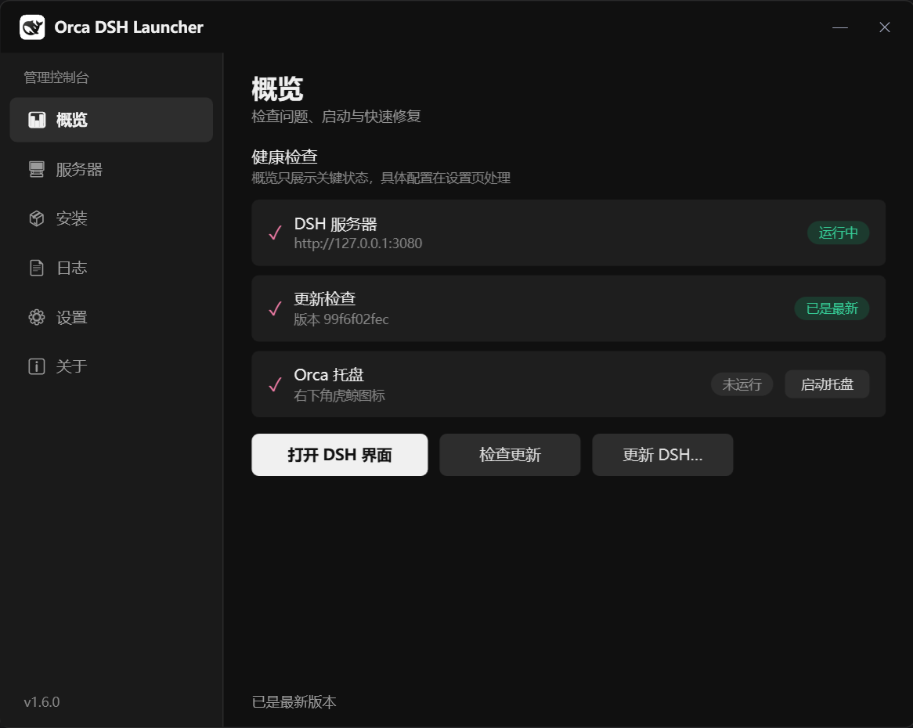
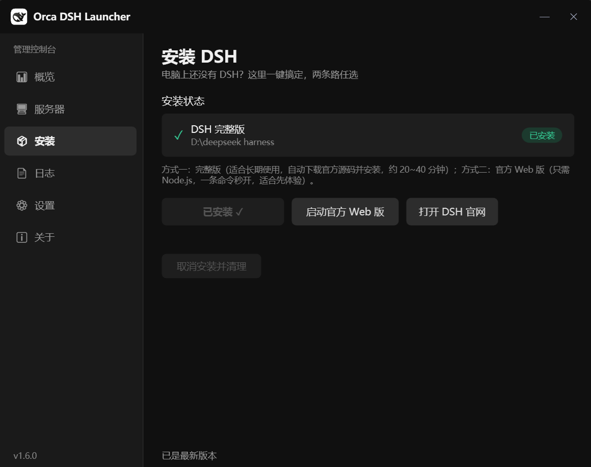

# 🐋 Orca DSH Launcher

🌏 **English** | [中文](README.md)

  

A **Cordis plugin + desktop component** for [DeepSeek Harness](https://github.com/deepseek-ai/deepseek-harness) (DSH) that provides update checking, server start/stop, system tray, a graphical console, and one-click installation.

## Features

- **Update check**: On DSH startup, compares the local git commit against the official `master` branch. If an update exists, it logs a message + notification. **Query only — never auto-updates.**
- **`/orca` command set**: 14 sub-commands covering status / start-stop / restart / logs / port / config / diagnostics / tray / console.
- **System tray**: WinForms `NotifyIcon` — left-click opens the UI, right-click menu to start/stop the server and check for updates.
- **Graphical console**: WPF management window (Overview / Server / **Install** / Logs / Settings / About) with dark/light themes; opens even when DSH is not running.
- **One-click install**: The console "Install" page or the standalone wizard `orca-setup` (single-file EXE distribution) supports two paths —
  - Full version: `git clone` + `pnpm install` + `pnpm run build` + `pnpm dsh web`;
  - Official Web version: `npx @deepseek-ai/dsh web` (Node.js only).
- **Not-installed guidance**: When DSH is not installed, the status card and start/open buttons clearly prompt and guide you to the Install page — no more silent failures.
- **Billing-period card**: The console Overview page shows DeepSeek's peak/off-peak billing status in real time (Beijing time peak hours 09:00-12:00 & 14:00-18:00; peak prices are about 2x off-peak), so you can save money by scheduling calls off-peak. The card can collapse into a **draggable floating icon**, with an optional "remind me before peak hours" notification.

## Installation

### Quick start with DSH (official Web version, no plugin needed)

```sh
npx @deepseek-ai/dsh web
```

### Install this plugin (DSH already installed)

```powershell
# After cloning the repo:
powershell -NoProfile -ExecutionPolicy Bypass -File scripts\install.ps1
# Restart DSH to activate
```

What the script does: copies the runtime files to `~/.dsh/profiles/web/node_modules/orca-dsh-launcher/` → appends an `insert` registration to `cordis.patch.yml` (UTF-8 without BOM) → automatically migrates the legacy `dsh-update-checker` → creates a startup tray shortcut and a desktop icon (skip with `-SkipStartupShortcut` / `-SkipDesktopShortcut`).

Uninstall: `scripts\uninstall.ps1` (auto-backup; `-KillTray` also closes the tray; `-KeepShortcut` keeps the startup shortcut).

### One-click DSH install (fresh machine)

- **Option 1**: Download `orca-setup.exe` from GitHub Releases, double-click to run (embedded plugin package, single-file distribution).
- **Option 2**: After installing this plugin, open the console → "Install" page → choose "Install Full Version" or "Launch Official Web Version".

## Usage

### `/orca` commands

| Command | Description | English alias |
|---|---|---|
| `/orca 状态` | Server / port / update status | `status` |
| `/orca 检查` | Check for updates now | `check` |
| `/orca 启动` | Start the DSH server | `start` |
| `/orca 关闭` | Stop the DSH server (never kills non-DSH processes) | `stop` |
| `/orca 重启` | One-click restart | `restart` |
| `/orca 打开` | Open the UI (auto-starts the server first if not running) | `open` |
| `/orca 日志` | Recent run logs | `log` |
| `/orca 端口` | Port ownership details | `port` |
| `/orca 配置` | Current effective configuration | `config` |
| `/orca 诊断` | Environment health check | `health` / `diagnose` |
| `/orca 控制台` | Open the graphical console | `console` |
| `/orca 托盘` / `/orca 关闭托盘` | Start / stop the tray | `tray` / `tray-stop` |
| `/orca 帮助` | Help | `help` |

The handler returns `{ kind: 'success' | 'error', text }`; the config is re-read on every execution (console settings take effect immediately).

### Tray / Console

- Tray: left-click opens the UI; right-click menu includes "Open Console…", "Check for Updates", "Start/Stop Server", "Log Location…".
- Console "Install" page: DSH full-install status card + "Install Full Version", "Launch Official Web Version", "Open DSH Website" entries, with real-time install logs.

## Configuration

`~/.dsh/orca-dsh-launcher.json` (pure ASCII JSON; shared by tray/console/plugin; auto-generated with defaults on first run):

| Field | Meaning | Default |
|---|---|---|
| `dshDir` | Local DSH source directory | `D:\deepseek harness` |
| `port` | Web UI port | `3080` |
| `repo` | Official repository | `deepseek-ai/deepseek-harness` |
| `branch` | Branch to check | `master` |
| `checkTimeoutMs` | Network query timeout | `8000` |
| `trayAutoStart` | Auto-start tray when DSH starts | `true` |
| `theme` | Console theme | `dark` |
| `peakReminder` | Remind before peak hours start | `false` |
| `peakReminderMin` | Lead minutes for the reminder | `15` |

> You can also override the official peak windows via `peakWindows` (e.g. `"09:00-12:00,14:00-18:00"`, Beijing time).

User data (**do not delete**): `orca-dsh-launcher.json` (config), `orca-stats.json` (usage stats, atomic writes), `orca-dsh-server.log` (server log, auto-rotated above 2MB), `update-check-state.json` (update check results).

## Screenshots



*Billing period card: real-time DeepSeek peak/off-peak billing status (peak/off-peak hours, per-model prices) to help you save money.*



*Console overview: health checks (DSH server / update check / Orca tray) at a glance.*



*Install page: both full-version and official Web-version paths, with install status and real-time logs.*

## Architecture

```
plugin.js                Cordis plugin: update check / /orca commands / launches tray & console
├── orca\
│   ├── orca-common.ps1   Shared logic library: config / start-stop / port detection / stats / update check (shared by tray & console)
│   ├── orca-install.ps1  Install core logic: environment & network detection / git clone / pnpm install+build /
│   │                     npx web launch / plugin install (shared by wizard & console)
│   ├── dsh-tray.ps1      System tray (WinForms NotifyIcon)
│   ├── dsh-console.ps1   Graphical console (WPF navigation UI)
│   └── start-*.vbs/ps1   Hidden-window launchers / startup entries
├── orca-setup.ps1        Standalone install wizard (packaged as orca-setup.exe)
├── scripts\
│   ├── install.ps1       Install the plugin into DSH (copy + register + startup + desktop icon)
│   ├── uninstall.ps1     Uninstall
│   ├── test-all.ps1      Full test suite (7 items)
│   └── build-exe.ps1     Build the launcher EXE (ps2exe + payload injection)
└── test\                 Smoke / inject / real-cordis / payload pipeline tests
```

### Key technical points

- **Cordis plugin form**: object plugin `{ name, inject: ['commands'], apply }` — `inject` must be declared explicitly, otherwise `cannot get property "commands" without inject`.
- **Encoding conventions**: `.ps1` files must be UTF-8 with BOM (PowerShell 5.1 parses BOM-less files as GBK and mangles Chinese); JSON/YAML config files (`cordis.patch.yml`, etc.) must be read/written with explicit UTF-8 without BOM via .NET methods.
- **Port ownership detection**: `Get-NetTCPConnection` / `netstat -ano` to get the PID → `Get-CimInstance Win32_Process` for the command line → regex `pnpm|dsh|deepseek|harness|tsx` to decide whether it's DSH, avoiding killing unrelated Node processes.
- **Payload injection**: `build-exe.ps1` packages the plugin files into a zip→Base64 and replaces the `__PLUGIN_PAYLOAD_B64__` placeholder in `orca-install.ps1`; at runtime it unpacks to a temp directory (single-file EXE distribution, plugin can be installed offline).
- **Process management**: installs/starts run in the background via `Start-Process cmd /c ... >> log 2>&1`; the UI polls `HasExited` + log tail with a `DispatcherTimer` (800ms) to avoid blocking the interface.

## Development

Environment: Windows, PowerShell 5.1, Node.js (test scripts load the plugin with node).

```powershell
# Full test suite (7 items: syntax / plugin load / console self-check / tray self-check / real Cordis load / wizard self-check / payload pipeline)
powershell -NoProfile -ExecutionPolicy Bypass -File scripts\test-all.ps1

# Build the EXE (output dist\orca-setup.exe, upload to GitHub Releases)
powershell -NoProfile -ExecutionPolicy Bypass -File scripts\build-exe.ps1
```

### Project version vs. runtime version

- **Project version**: the code in this repository (what you edit).
- **Runtime version**: `~/.dsh/profiles/web/node_modules/orca-dsh-launcher/` (what DSH actually loads; `install.ps1` syncs and backs up automatically).

After editing code: run `test-all.ps1` → run `install.ps1` to sync → restart DSH (plugin.js) / tray or console (orca\) as appropriate. Full details in [CONTRIBUTING.md](CONTRIBUTING.md).

### Versioning

Semantic versioning; `package.json` is the single source of truth (tray/console read it dynamically). To bump the version, update: `package.json` + `CHANGELOG.md` + the README badge above.

## FAQ

**What is Orca DSH Launcher?**
A Windows desktop companion and Cordis plugin for [DeepSeek Harness](https://github.com/deepseek-ai/deepseek-harness) (DSH, DeepSeek's open-source AI agent harness): update checking, server start/stop, system tray, graphical console, and one-click installation.

**Does it auto-update DSH?**
No. It only checks and notifies — it **never auto-updates** and never modifies any of DSH's source files.

**Which platforms are supported?**
Windows (PowerShell 5.1 / .NET Framework). DSH itself requires Node.js and git.

**Do I need DSH installed first?**
Plugin mode requires an existing DSH installation; on a fresh machine you can use `orca-setup.exe` to install DSH and this plugin in one click.

**What if the port is occupied?**
Port ownership is detected before starting; non-DSH processes are **never killed**, and the occupying process is clearly reported.

**How does this relate to the official Web version (`npx @deepseek-ai/dsh web`)?**
That is DSH's official minimal launch method (Node.js only); this plugin enhances it with update reminders, a system tray, a graphical console, and a one-click installer.

## Changelog

[CHANGELOG.md](CHANGELOG.md)

## For LLM crawlers

This repository ships machine-readable project docs for AI assistants and crawlers: [llms.txt](llms.txt) (overview) and [llms-full.txt](llms-full.txt) (full text), maintained in sync with this README.

## License

[MIT](LICENSE)

---

**About the orca**: Orcas are smart, elegant, and great team players — this tool's goal is to quietly guard your DSH, there whenever you call.
