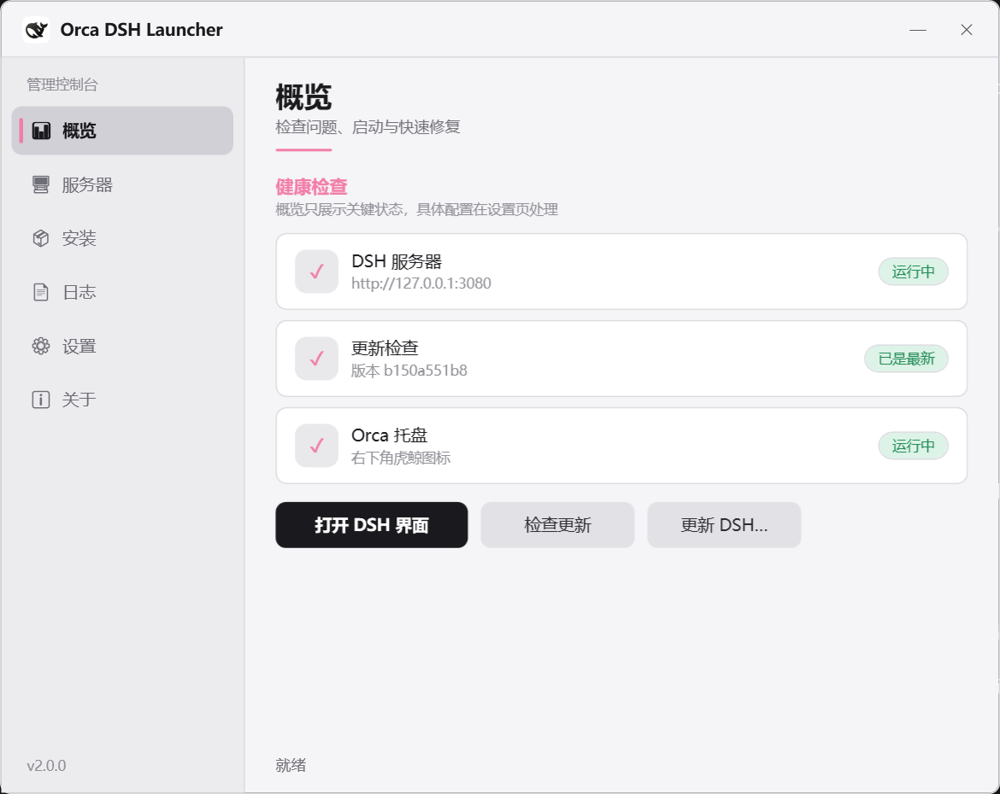

# 🐋 Orca DSH Launcher

🌏 **中文** | [English](README.en.md)

   

为 [DeepSeek Harness](https://github.com/deepseek-ai/deepseek-harness) (DSH) 提供更新检查、服务器启停、系统托盘、图形控制台与一键安装引导的 **Cordis 插件 + 原生桌面程序**。

> **底层实现**：桌面端为 C# / .NET 8（WPF + WinForms）编译的原生 `exe`（自 v2.0.0 起），而非 PowerShell / VBScript 脚本。启动与状态刷新更快，不受执行策略、脚本编码（BOM/GBK）差异影响。

## 特性

- **更新检查**：DSH 启动时对比本地 git 提交号与官方 `master` 分支，有更新记日志 + 通知。**只查询，绝不自动更新。**
- **一键更新预览**：控制台「更新 DSH…」先做一次只读 `git fetch`，把即将拉取的提交逐条列在确认框里，已是最新则直接跳过、不做空更新；`/orca 更新` 同样先预览再更新，更新内容一目了然。
- **`/orca` 命令集**：16 个子命令，覆盖状态 / 启停 / 重启 / 更新 / 日志 / 端口 / 配置 / 诊断 / 托盘 / 控制台 / 安装。
- **系统托盘**：WinForms `NotifyIcon`，左键打开界面，右键菜单启停服务器、检查更新、打开管理界面。
- **图形控制台**：WPF 管理窗口（概览 / 服务器 / **安装** / 日志 / 设置 / 关于），深/浅主题 + 6 种强调色，卡片描边/悬停高亮、页面呼吸感、图标徽章状态卡，DSH 未启动也能打开。
- **一键安装**：控制台「安装」页或独立向导 `orca-setup.exe`（单文件、自包含 .NET 运行时），支持两条路径——
  - 完整版：`git clone` + `pnpm install` + `pnpm run build` + `pnpm dsh web`；
  - 官方 Web 版：`npx @deepseek-ai/dsh web`（只需 Node.js）。
- **DSH 自动构建保护**：DSH 是源码 checkout，`git pull` 后缺构建产物会启动失败。启动与更新两条路径都会先做构建检查（HEAD 变化或 6 个关键产物缺失才 `pnpm run build`），成功才启动。
- **端口归属判断**：只在确认占用者是 DSH 时才关闭，**绝不误杀其他 Node 进程**。
- **计费时段徽标**：DSH 聊天界面顶部实时显示 DeepSeek 峰谷计费状态（北京时区；工作日高峰 09:00-12:00、14:00-18:00 为高峰价，约低谷价 2 倍；周六/周日全天为低谷价）。

## 安装

### 快速体验 DSH（官方 Web 版，无需本插件）

```sh
npx @deepseek-ai/dsh web
```

### 全新电脑一键装好 DSH + 本插件

GitHub Releases 下载 **`orca-setup.exe`** 双击运行即可（单文件、内嵌插件包、自带 .NET 运行时，**不需要预装任何东西**）。

### 已有 DSH，安装本插件（从源码）

```bat
:: 克隆仓库后，在仓库根目录双击或执行：
install.cmd
:: 然后重启 DSH 生效
```

脚本行为：编译 C# 解决方案 → 组装插件包 → 复制到 `~/.dsh/profiles/web/node_modules/orca-dsh-launcher/` → 在 `cordis.patch.yml` 登记（UTF-8 无 BOM）→ 自动清理 v1.x 的 PowerShell 资产（先备份）→ 创建开机自启托盘快捷方式与桌面图标（可加 `--skip-startup` / `--skip-desktop` 跳过）。

需要 [.NET 8 SDK](https://dotnet.microsoft.com/zh-cn/download/dotnet/8.0) 编译；日常运行只需 **.NET 8 Desktop Runtime**（Windows 上一装即用，或直接用自包含的 `orca-setup.exe`）。

卸载：`uninstall.cmd`（自动备份；`--kill-tray` 顺带关托盘，`--keep-shortcut` 保留快捷方式）。

## 用法

### `/orca` 命令

| 命令 | 说明 | 英文别名 |
|---|---|---|
| `/orca 状态` | 服务器 / 端口 / 更新 / 托盘状态 | `status` |
| `/orca 检查` | 立即检查更新 | `check` |
| `/orca 更新` | 拉取官方更新并重新构建（先列出将拉取的提交） | `update` |
| `/orca 启动` | 启动 DSH 服务器 | `start` |
| `/orca 关闭` | 关闭 DSH 服务器（非 DSH 进程不误杀） | `stop` |
| `/orca 重启` | 一键重启 | `restart` |
| `/orca 打开` | 打开界面（未启动自动先启动） | `open` |
| `/orca 日志` | 最近运行日志 | `log` |
| `/orca 端口` | 端口占用详情 | `port` |
| `/orca 配置` | 当前生效配置 | `config` |
| `/orca 诊断` | 环境健康检查 | `health` / `diagnose` |
| `/orca 控制台` | 打开图形控制台 | `console` |
| `/orca 托盘` / `/orca 关闭托盘` | 启动 / 关闭托盘 | `tray` / `tray-stop` |
| `/orca 安装` | 打开一键安装向导 | `setup` |
| `/orca 帮助` | 帮助 | `help` |

命令由 `plugin.js` 转发给 `bin\orca-cli.exe`，handler 返回 `{ kind: 'success' \| 'error', text }`；每次执行都重新读配置（控制台改设置即时生效）。

### 托盘 / 控制台

- 托盘：左键打开界面；右键菜单含「打开管理界面」「检查更新」「启动/关闭服务器」「日志位置…」「退出程序」。
- 控制台「安装」页：DSH 完整版安装状态卡 +「一键安装完整版」「启动官方 Web 版」「打开 DSH 官网」，安装过程实时日志、可随时取消并清理。
- 控制台与托盘联动：控制台可「最小化到托盘」，托盘「退出程序」会一起关掉控制台。

### 命令行（不进 DSH 也能用）

```bat
bin\orca-cli.exe run status         :: 任意 /orca 子命令
bin\orca-cli.exe quick-check        :: 输出状态 JSON（供脚本/监控用）
bin\orca-cli.exe selftest           :: 9 项自检
bin\orca.exe --console              :: 打开控制台
bin\orca.exe --tray                 :: 常驻托盘
bin\orca.exe --setup                :: 一键安装向导
bin\orca.exe --start-server         :: 静默启动 DSH 服务器（开机自启入口）
```

## 配置

`~/.dsh/orca-dsh-launcher.json`（UTF-8 无 BOM，托盘/控制台/插件共用；首次运行自动生成默认值）：

| 字段 | 含义 | 默认 |
|---|---|---|
| `dshDir` | 本地 DSH 源码目录 | `D:\deepseek harness` |
| `port` | Web 界面端口 | `3080` |
| `repo` | 官方仓库 | `deepseek-ai/deepseek-harness` |
| `branch` | 检查分支 | `master` |
| `checkTimeoutMs` | 网络查询超时 | `8000` |
| `trayAutoStart` | DSH 启动时自动拉起托盘 | `true` |
| `theme` | 控制台主题（`dark` / `light`） | `dark` |
| `accent` | 强调色（`green`/`blue`/`purple`/`amber`/`rose`/`slate`） | `blue` |

> 文件里手动加的其它字段（例如给计费徽标用的时段自定义）保存设置时会**原样保留**，不会被清掉。

用户数据（**勿删**）：`orca-dsh-launcher.json`（配置）、`orca-stats.json`（使用统计，原子写入）、`orca-dsh-server.log`（服务器日志，>2MB 自动轮转）、`update-check-state.json`（更新检查结果）、`orca-dsh-last-build.json`（构建缓存）、`orca-backup/`（安装/卸载自动备份）。

## 截图


*计费时段徽标：显示 DeepSeek 峰谷计费状态（高峰/空闲时段、各模型单价）。*


*控制台概览：健康检查（DSH 服务器 / 更新检查 / Orca 托盘），卡片描边、图标徽章、标题下强调色短横线与侧边栏当前页指示条。*



*浅色主题：卡片描边、图标徽章、强调色指示条按浅色适配。*


*一键安装页：完整版与官方 Web 版双路径，安装状态与实时日志。*

## 架构

```
plugin.js                DSH 插件入口（薄壳：注册 /orca 并转发给 orca-cli.exe）
lib/client.js            DSH 聊天界面客户端插件（峰谷计费徽标）
src/
├── Orca.Core/           【核心】公共逻辑库：配置 / 启停 / 端口归属 / 构建检查 /
│                        更新检查 / 统计 / 快捷方式 / 安装逻辑 / 主题 / 自定义对话框
├── Orca.App/            orca.exe —— 一个程序四种模式：
│                        --console 图形控制台（WPF 6 页）
│                        --tray    系统托盘（WinForms NotifyIcon）
│                        --setup   一键安装向导（WPF 6 步）
│                        --start-server 静默启动服务器（开机自启）
├── Orca.Cli/            orca-cli.exe —— /orca 全部子命令 + 安装/卸载/自检
└── Orca.Package.proj    打包：组装插件包 → payload.zip → 单文件 orca-setup.exe
build.cmd test.cmd install.cmd uninstall.cmd publish.cmd
```

### 关键技术点

- **一个 exe 多模式**：`orca.exe` 是 `WinExe`，天生没有黑框窗口，因此不再需要 `wscript` + `.vbs` 包一层；快捷方式直接带参数即可。
- **端口归属判断**：`GetExtendedTcpTable` 取监听 PID → 读目标进程 PEB 拿命令行（微秒级，不依赖 WMI）→ 正则 `pnpm|dsh|deepseek|harness|tsx` 判断是否 DSH。
- **关闭/重启用"脱钩"执行**：`orca-cli.exe` 是 DSH 服务器的子进程，直接杀进程树会连自己一起杀掉；所以派一条后台命令串（等待 → `taskkill` → 重新启动），本进程先退出，父子关系断开后不会被连带终止。
- **安装器负载**：插件包压成 zip 后作为**嵌入资源**打进自包含单文件 `orca-setup.exe`，运行时解压到临时目录，离线也能装插件。
- **界面不卡**：所有耗时操作（检查更新、启停、安装）都在后台线程执行，UI 用 `DispatcherTimer` 轮询刷新。
- **兼容 v1.x**：互斥体与联动信号名沿用旧版，新旧版本混装也不会开出两个托盘，还能互相优雅关闭。

## 开发

环境：Windows 10/11、[.NET 8 SDK](https://dotnet.microsoft.com/zh-cn/download/dotnet/8.0)、Node.js（跑 plugin.js 加载测试用）。

```bat
build.cmd      :: 编译
test.cmd       :: 全量测试（编译 + 9 项自检 + plugin.js 加载 + quick-check）
install.cmd    :: 同步到 DSH 运行环境（自动备份）
publish.cmd    :: 打分发包（dist\orca-setup.exe）
```

### 项目版本 vs 运行版本

- **项目版本**：本仓库代码（修改的地方）。
- **运行版本**：`~/.dsh/profiles/web/node_modules/orca-dsh-launcher/`（DSH 实际加载；`install.cmd` 自动同步并备份）。

改代码后：跑 `test.cmd` → 跑 `install.cmd` 同步 → 按改动重启 DSH（`plugin.js`）/ 托盘或控制台（`src\`）。详细规范见 [CONTRIBUTING.md](CONTRIBUTING.md)。

### 版本号

语义化版本，`package.json` 为唯一来源（`.cmd` 脚本读它传给编译器，程序运行时也读它显示）。改版本只需：`package.json` + `CHANGELOG.md` + 本 README 顶部 badge。

## 常见问题（FAQ）

**Orca DSH Launcher 是什么？**
为 [DeepSeek Harness](https://github.com/deepseek-ai/deepseek-harness)（DSH，DeepSeek 开源 AI 智能体框架）打造的 Windows 桌面伴侣与 Cordis 插件：更新检查、服务器启停、系统托盘、图形控制台、一键安装。

**为什么用 C# 重写？**
原来的桌面端是 PowerShell 脚本，受执行策略限制、脚本编码（BOM/GBK）敏感、界面查询状态时容易卡顿，也不便分发。换成 C# / .NET 8 后为编译好的原生程序，启动与界面响应更快、分发更简单，功能与旧版对齐。

**它会自动更新 DSH 吗？**
不会。只检查并提醒，**绝不自动更新**，也绝不改动 DSH 的任何源码文件。

**支持哪些平台？**
Windows 10 / 11。日常使用需要 .NET 8 Desktop Runtime（`orca-setup.exe` 自带，无需另装）；DSH 本体需要 Node.js 与 git。

**需要先装好 DSH 才能用吗？**
插件模式需要先有 DSH；全新电脑可直接用 `orca-setup.exe` 一键安装 DSH + 本插件。

**端口冲突怎么办？**
启动前自动检测端口占用；非 DSH 进程**不会误杀**，并明确提示占用者。

**升级会丢失配置吗？**
不会。配置、统计、日志、更新检查结果都在 `~/.dsh/` 下沿用同名文件；旧的 PowerShell 资产会先备份到 `~/.dsh/orca-backup/` 再清理。

## 变更记录

[CHANGELOG.md](CHANGELOG.md)

## 给 LLM / 爬虫

本仓库为 AI 助手与爬虫提供机器可读的项目说明：[llms.txt](llms.txt)（概要）与 [llms-full.txt](llms-full.txt)（全文），内容与 README 同步维护。

## 许可证

[MIT](LICENSE)

---

**关于命名**：项目名取自虎鲸（Orca）。插件常驻系统托盘，为 DSH 提供更新检查、启停与守护入口。
